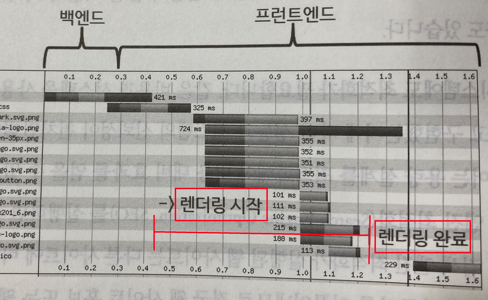

# 5 웹에서 가속을 이끌어 내는 방법

웹이 화면에 보이기까지 가장 많은 시간이 소요 되는 부분이 렌더링임.   
렌더링은 웹 브라우저가 담당함.   
   

## 5.1 웹 브라우저 현황 알아보기

사용률 1위:   
 
크롬(데스크톱:69%, 모바일:64%)   

기타:   
 
사파리
    
 
파이어폭스        
   
 
삼성 인턴넷 브라우저

TODO 각 브라우저의 차이점

## 5.2 웹 브라우저 동작 이해하기

### 5.2.1 브라우저 아키텍처

### 5.2.2 중요 렌더링 경로

## 5.3 브라우저 렌더링 최적화하기

### 5.3.1 DOM 최적화하기

### 5.3.2 자바스크립트와 CSS 배치하기

### 5.3.3 자바스크립트 최적화하기

### 5.3.4 CSS 최적화하기

### 5.3.5 이미지 로딩 최적화하기