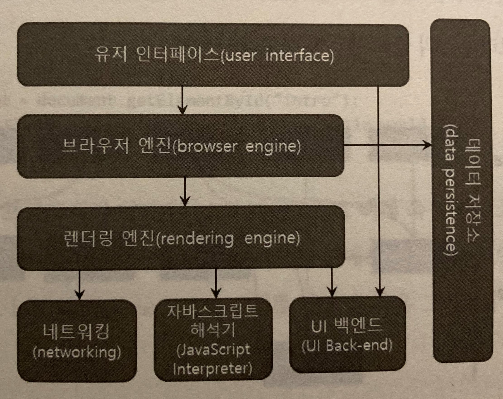
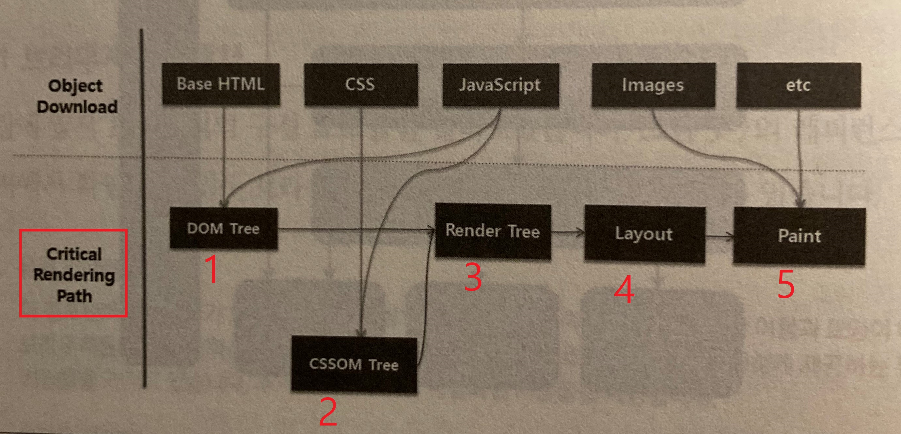
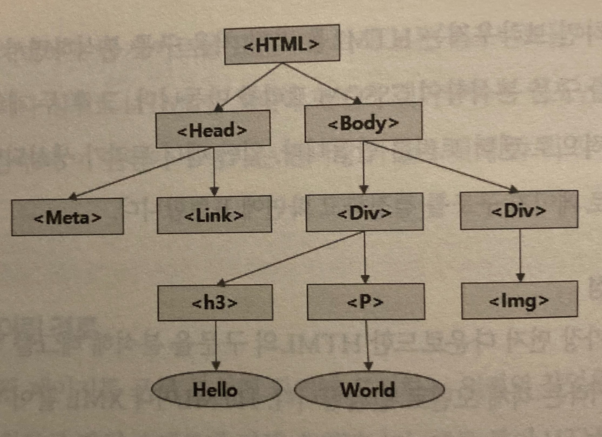
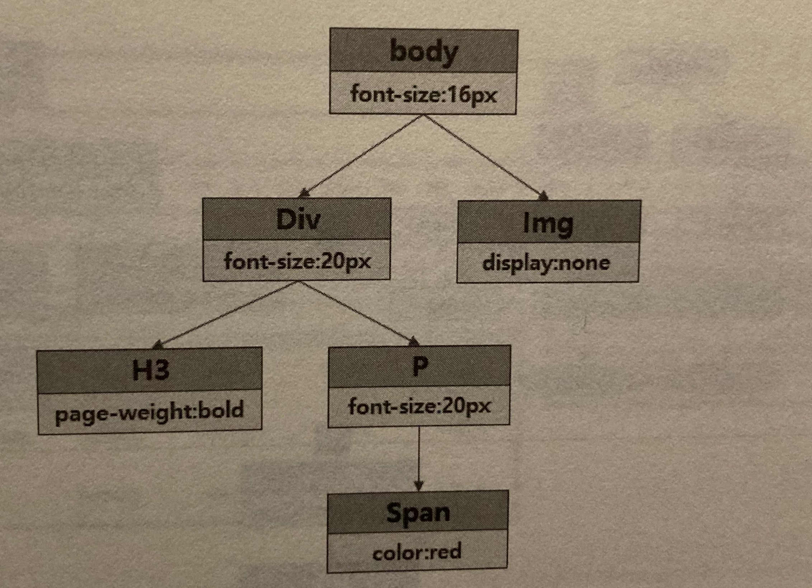
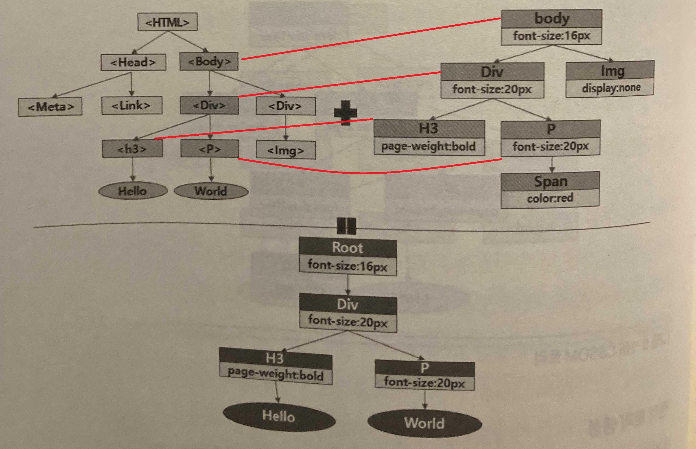

# 5 웹에서 가속을 이끌어 내는 방법

웹이 화면에 보이기까지 가장 많은 시간이 소요 되는 부분이 렌더링임.   
렌더링은 웹 브라우저가 담당함.   
   

## 5.1 웹 브라우저 현황 알아보기

사용률 1위:   
<br>
크롬(데스크톱:69%, 모바일:64%)   

기타:   
<br>
사파리
    
<br>
파이어폭스        
   
<br>
삼성 인터넷 브라우저
  
<br>  <br>  
※ 각 브라우저는 성능만 다를뿐 아니라 지원하는 기능도 다름.  
ex) WebP 이미지(크롬 브라우저 등), JPEG XR 이미지(익스플로러,엣지만 지원), JPEG 2000(사파리만 지원)


## 5.2 웹 브라우저 동작 이해하기

### 5.2.1 브라우저 아키텍처(브라우저 컴포넌트)

   

1. 유저 인터페이스: UI.주소창, 뒤로가기 버튼과 같은 화면구성.
2. 브라우저 엔진: 렌더링 상태 조회, 렌더링 작업 조회.
3. 렌더링 엔진: HTML태그 및 CSS를 실제 화면에 그려줌.
4. 네트워킹: 서버와 통신 담당.
5. UI 백엔드: 셀렉트 박스, 인풋 박스, 체크 박스 등을 그리는걸 도와줌
6. 자바스크립트 해석기: 자바 스크립트를 실행해 렌더링 엔진으로 보내주는 인터프리터.
7. 데이터 저장소: 쿠키, 로컬 스토리지, 세션 스토리지 등의 저장소.

위 7 컴포넌트 들이 유기적으로 동작해 화면을 만들어 냄.  
그 중 HTML을 처리해 화면에 렌더링 하는 컴포넌트인 렌더링 엔진을 더 살펴보겠음.

### 5.2.2 중요 렌더링 경로

   

1. DOM 트리: HTML의 구문을 분석해 태그를 판별하여 트리를 만듬.  
<br>  

2. CSSOM 트리: CSS파일을 분석해 트리로 만듬.
<br>  

3. 렌더 트리: DOM 트리와 CSSOM를 합쳐 새로 트리를 구성.
<br>  

4. 레이아웃: 화면크기를 바탕으로 각 노드들의 위치 좌표 계산.

5. 페인트: 화면에 그려줌.

## 5.3 브라우저 렌더링 최적화하기

### 5.3.1 DOM 최적화하기

HTML 구문 분석기는 오류에 관대함.  
제한이상의 중첩된 태그를 쓰거나, 태그를 실수로 안닫고 테이블안에 또 테이블을 넣는 등 잘못된 문법으로 작성해도 구문 분석기가 알아서 처리해줌.  
하지만 많은 메모리와 CPU를 사용하게 됨.   
-방법-  
- 구문 오류를 최소화하고 간소화하는 것이 성능을 향상시키는 기본적인 방법. 대부분 브라우저 개발자 도구에서 알려줌.  
- 과도하게 HTML 태그를 중첩하지 말 것.(15단계 미만) 연산하는데 더 많은 리소스 소모.
- DOM Monster 이용해보기.(실습에 있음. 최적화 방안 알려줌.)

### 5.3.2 자바스크립트와 CSS 배치하기   
분식기는 소스를 위에서부터 차례로 한줄씩 읽어 가는데 HTML DOM생성기는 자바스크립트를 만나면 중지되고 자바스크립트해석은 CSS를 만나면 중지된다.   

HTML<=>CSS(관계없음, 트리가 다름DOM, CSSOM)    
HTML==JS(동시진행 안됨, HTML은 DOM 트리인데 JS가 DOM트리를 변경시킬수 있으므로 중단.)    
JS==CSS(동시진행 안됨, CSS는 CSSOM 트리인데 JS가 CSSOM트리를 변경 시킬수 있으므로 중단.)    
  
이러한 CSS와 자바스크립트의 렌더링 방해를 피하려면 CSS를 최대한 위로 올려 CSSOM이 빨리 생성되도록하고, JS는 밑으로 내려 DOM과, CSSOM이 생성된 이후에 실행될수 있게 만들면 됨.

-방법-
- CSS는 HTML 위쪽에, JS는 HTML아래쪽에 작성한다.

### 5.3.3 자바스크립트 최적화하기

페이지 로드 시간이 길어지면 텍스트를 입력 등 사용자와 웹의 상호작용을 할 수 없는 시간이 늘어나 불편해지는데, 자바스크립트를 전체 페이지 로딩 시간에 포함시키지 않으려면 async나 defer 속성으로 비동기적으로 자바스크립트를 실행 시켜야한다.  

```html
<script src="async_script.js" async></script> <!-- HTML 렌더링과 상관없이 다운로드 완료즉시 실행 -->
<script src="defer_script.js" defer></script> <!-- 다운로드 해 놓고 HTML 구문 분석이 끝나면 실행 -->
```
```html
<script src="first.js" async></script> <!-- 용량 10만 메가 -->
<script src="second.js" async></script> <!-- 용량 3바이트 -->
<!-- 실행순서(다운로드완료순): second->first -->
```
```html
<script src="first.js" defer></script> <!-- 용량 10만 메가 -->
<script src="second.js" defer></script> <!-- 용량 3바이트 -->
<!-- 실행순서(소스라인순서순): first->second -->
```
- async, defer 보다 명시적인 방법은 document.onload 이벤트에 자바스크립트를 적어주면 됨.


### 5.3.4 CSS 최적화하기

CSS는 내가 필요하지 않은 부분도 많음. 이 부분을 줄여야함.(ex.전체페이지 CSS를 하나로 뭉쳐놓거나, 화면사이즈 별로 똑같은 css 여러개 들어가있거나)  

-필요한 CSS만 받는 방법-
1. 화면 나누기
```html
<link rel="stylesheet" ... media="screen and (max-device-width:480px)">
<link rel="stylesheet" ... media="screen and (min-device-width:781px)">
<link rel="stylesheet" ... media="screen and (max-device-width:780px) and (min-device-width:481px)">
```

2. 나중에 쓸 CSS 뒤로 미루기
```html
<link rel="stylesheet" ... defer-ref="css/myCss.css" > <!-- href속성없음 -->

<script>
    function deferOnload() {
        var linkTags = document.getElementsByTagName('link');
        for(link태그 갯수만큼 반복) {
            if(link태그에 defer-ref 속성 있는지) {
                link태그.href = link태그.defer-ref;
            }
        }
    }

    window.onload = deferOnload;
</script>
```

### 5.3.5 이미지 로딩 최적화하기   

웹 최적화에 있어 이미지 로딩 최적화는 필수일 정도로 효과가 좋음.  
그렇지만 무분별하게 쓰면 안됨. 랜딩페이지에서 첫눈에 보이지 않는부분에서만 써야함.

-이미지 로딩을 늦추는 방법-  
- 해당 이미지가 웹 사이트의 주요 이미지가 아니면 CSS의 background-image 속성을 이용하면 무조건적인 다운로드를 피할수있음. 브라우저가 CSS를 분석할때 display:none이 있으면 숨겨질 이미지인것을 알고 미리 다운로드 하지 않음.  
```html
<div style="background-image=abc.jpg display:none" > <!-- abc.jpg 다운로드 안함 -->
```

- 자바스크립트 지연 로딩 적용.(document.onload이벤트에 추가해서 나중에 다운.)

- Progressive JPG 사용하기.   
구글 검색 이미지탭에서 사진 하나를 눌러보면 처음 1~2초간은 해상도 낮은 사진이 보이다 나중에 고화질 사진이 보임.  
구글은 저화질->고화질 2단계 이나 Progressive JPG는 여러단계로 나눠져있음.

일반 사진인지 Progressive한 사진인이 확인법: 일반이나 Progressive나 둘다 확장자는 같음. http://techslides.com/demos/progressive-test.html 이런곳에서 파일 업로드해서 확인해봐야함.


<br>&nbsp;  
<좌:데이터30%, 우:데이터70%>   
사용법: 포토샵 사진 저장 할때 Progressive 옵션 사용하기.Progressive JPEG Convertes(ex.RIOT, Kraken.io 등) 이용하기(인코딩을 Progressive로 선택)

## 실습 택1
- DOM 최적화하기(DOM Monster)  
https://mir.aculo.us/dom-monster/ 에 들어가셔서 본문 중간쯤 Drag the DOM Monster! to your bookmarks bar! 라고 적힌부분에 갈색버튼을 즐겨찾기 바로 드래그 한뒤.  
분석할 페이지로 들어가서 즐겨찾기 된 [DOM Monster!]를 클릭 하면 결과가 나옴.  
거기보면 [TIP]이 여러개 나오는데 거기에 맞게 고쳐보기.

- 자기 프로젝트에 CSS 최적화 해보기.  
당장 안쓰는 CSS를 onload이벤트로 넣거나, 화면 사이즈 분기 되어있는 CSS 파일 분리 시켜보기.