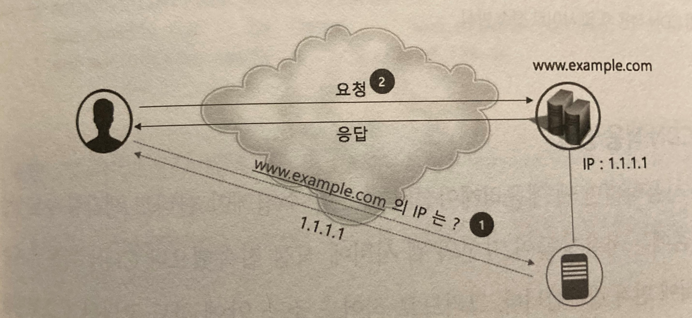
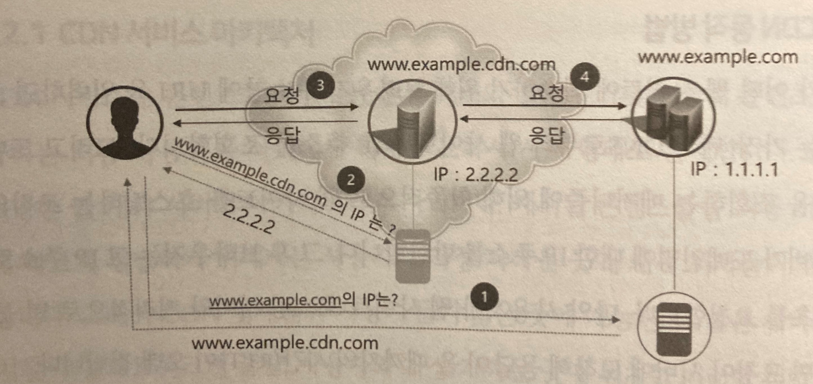
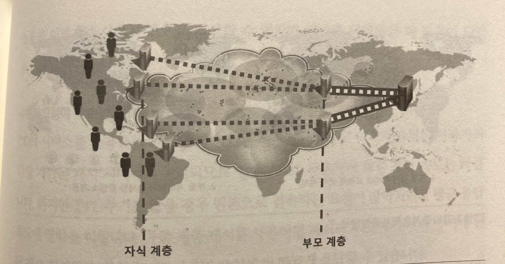

# 7.CDN(Content Delivery Network)

## 7.1 해외지역으로 서비스 확장시 CDN을 사용하는 이유

### 국내에 데이터 센터를 두고있는 사이트가 있다.
### 이 사이트는 방문자 수가 많아져 해외 까지 진출하려고 한다. 
### 해외로 서비스를 확장하는데 몇 가지 방법이 존재한다.

1. 기존 서버 용량 증설(지리적 거리가 멀어 사이트 속도 보장x)
2. 해외에 직접 데이터 센터 구축(많은 비용, 기존 앱과 동기화를 위한 복잡한 아키텍처 설계 필요.)
3. 해외에 있는 호스팅 서버 이용(원본 앱의 수정, 테스트&배포 계획 꼼꼼히해야함, 동기화를 위한 아키텍처 설계 필요)
4. **CDN**

- 성능 및 안전성 보장
    - CDN 서비스 업체는 일반적인 호스팅 업체보다 많은 POP(Point Of Presence) (기지국 같은 것)를 보유하고 있음.  
    이는 인터넷 병목 구간을 더 쉽게 피할 수 있게 해주어 캐시 된 콘텐츠를 더 빠르게 전송 할 수 있고, 일부 POP이 사용할 수 없게 되어도 다른 POP로 서비스할 수 있어 안정적임.  

- 아키텍처 단순화
    - 원본 앱을 재배포하는 방식이 아니라 애플리케이션의 수정 및 동기화를 고려하지 않아 아키텍쳐 수정이 없음.

- 높은 비즈니스 투자 수익
    - CDN을 사용하면 데이터 센터를 새로 만들지 않아도 해외 시장에도 빠른 속도를 유지 할 수있어 많은 비용 절감. 물리적인 장비에 따른 유지보수 비용도 없음.

### CDN의 특징
- 동적 콘텐츠 가속
    - 텍스트, 이미지 등 기존 정적인 리소스 전송을 넘어 개인화, 모바일 앱 서비스 등을 위한 동적 리소스 전송이 많아짐. 이에 따라 CDN 회사들은 더 많은 ISP업체와 연계를 하고, 알고리즘을 통해 네트워크 최적의 경로를 찾아 많은 데이터를 더 빨리 전송 할수 있도록 함.
- 프런트엔드 최적화
    - CDN 회사는 프런트엔드 최적화 방안을 서버상에서 자동화 시켰음. 따라서 원본 서버에서 최적화를 구현하지 않아도 손쉽게 웹 사이트 로딩 속도를 개선 할 수 있음.
- 동영상 또는 라이브 스트리밍 서비스
    - CDN 회사는 HTTP프로토콜에서 동작하는 HLS, HDS, MPEG_DASH 같은 프로토콜을 지원하고 사용자의 네트워크 품질에 따라 영상의 비트 전송율을 조정해줌으로 원활한 영상 전송이 가능하게 함.
- 클라우드 보안
    - 데이터 서버를 직접 해외에 구축하면 보안도 직접 신경 써야하지만 CDN을 이용하면 업체에서 알아서 보안을 신경써줌.

## 7.2 CDN의 원리

※CDN은 클라우드 서비스의 일종임.  
AWS에서 쓰는것처럼 CDN도 사용자가 자신의 CDN을 설정하고 관리 할 수 있음.

### CDN 서비스 아키텍처

CDN 서버는 원본 서버와 사용자의 PC 사이에 존재하는데, 원본서버의 컨텐츠 파일을 캐시 해놓은 서버임. 사용자가 원본서버로 요청을 보내면 중간에서 캐치하기 때문에 빠른 응답 속도를 보장함. 이러한 서버는 컨텐츠 프록시 서버 인데, 그 중 사용자와 가까운 곳에 위치한 서버들을 에지 서버 라고 부름.

### CDN 동작 방법
- CDN 사용 전  

- CDN 사용 후  

### CDN 적용 방법

1. 원본 서버로 사용할 호스트명, IP를 네임 서버의 A레코드로 추가.  
    www.google.com IN A 106.10.178.36  
    **edge-www.google.com IN A 106.10.178.36** [추가]  

2. CDN 설정에 원본 서버의 호스트명으로 edge-www.google.com를 등록

3. 기존 도메인에 부여되어있던 IP정보를 CDN서비스 제공자가 제공해주는 비밀도메인명으로 변경  
    **www.google.com IN CNAME www.cdncompanyabcde.com**  
    edge-www.google.com IN A 106.10.178.36

## 7.3 다중 캐시 전략

CDN을 적용한다고 해도 캐시가 100% 보장 되는것은 아님.
따라서 사용자와 서버 사이에 여러 개의 캐시 계층을 주는 다중 캐시 기술이 필요함.  
캐시가 안되는 이유와 다중 캐시를 하는법을 알아보겠음.

- 캐시 축출  
    CDN 서버가 캐시된콘텐츠를 삭제하는 행위를 캐시 축출이라고 함.  
    CDN 캐시 서버는 제한된 용량으로 많은 양의 콘텐츠를 캐시 해야하기 때문에 우선순위를 부여해 낮은 순위의 콘텐츠는 삭제해 용량을 확보함.  
    이로인해 낮은 순위의 콘텐츠가 캐시가 되지 않을 경우가 있음.  
    

- 다중 계층 캐시   
    다중 계층 캐시는 에지 서버들과 원본 서버 사이에 캐시 서버 계층(부모 계층)을 추가 해 같은 콘텐츠를 여러 번 캐시 하는 방식임.  
    이를 사용하려면 두가지 조건이 있음.  
    1.부모 계층은 원본 서버에 가까이 있어야 한다.  
    2.부모 계층은 자식 계층은 서버 수 보다 훨씬 적어야 한다.  

    

    우선순위가 낮아 자주 삭제 되던 콘텐츠도 여러 자식계층에서 콘텐츠 호출을 받게되면 부모 계층의 콘텐츠는 우선 순위가 높아져 캐시가 삭제 될 걱정이 없어짐.

## 참고자료

- 유튜브 영상 [ 웹서비스에 필수! CDN이 뭔가요? - 얄팍한 코딩사전 ]  
    https://www.youtube.com/watch?v=_kcoeK0ITkQ
- 블로그 [ [AWS] CLOUDFRONT 캐시 적중률 늘리기 (CACHE HIT RATIO) ]  
https://manvscloud.com/?p=416
- 블로터 뉴스 [[망사용료 갈등]①넷플릭스는 SKB에 '콘텐츠 전송료' 내야 하나]  
https://www.bloter.net/newsView/blt202111100124